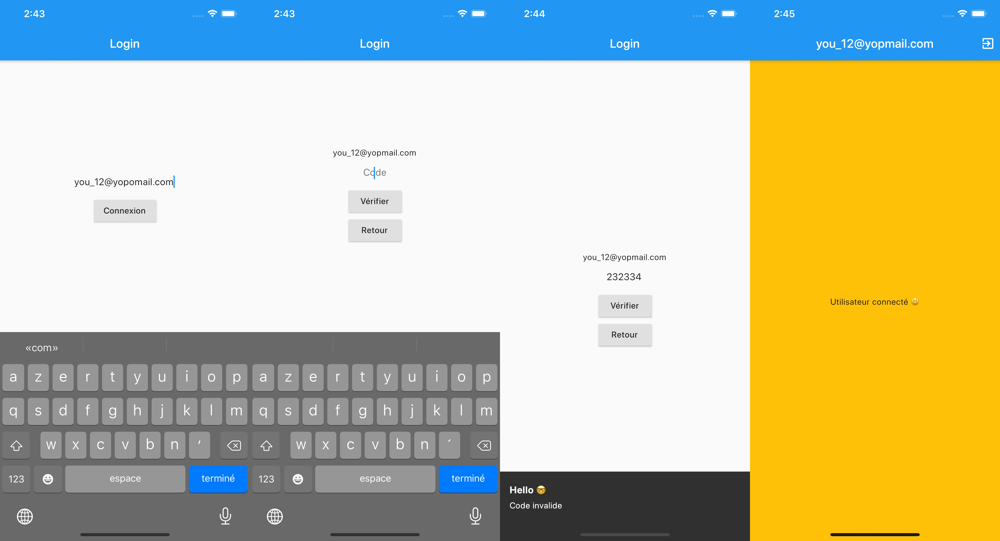

# OnBoarding BoilerPlate

C'est une section qui s'occupe d'iniatilisé l'application et fournir tout ce qui est necessaire à l'application pour fonctionner.

# Architecture

En bloc, l'idée c'est de pouvoir être flexible sur les step nécessaire pour l'application.

Pour l'instant il y a que le splashscreen et le login mais plus tard il pourrait y avoir des questions etc.. 

Il suffira juste d'ajouter des State et Event. ;) 

# Services

1. AWS Cognito mais en utilisant l'API et non les packages natives iOS et Android
    - Pour moins de dépendance avec AWS
    - Plus léger d'un point de vu application
    - Pour la persistance, je stock en sécurisé les crédentials avec le auth_storage.

# SubApp

1. Splaschreen lancement de l'initilisation en paralalle d'une animation
2. Login, connexion sans mot de passe avec un code envoyé par email (en deux sous étapes)

# Utils

1. Avoir les messages d'erreur en fonction de l'erreur
2. la regex pour valider l'email
3. Un générateur de mot de passe random
